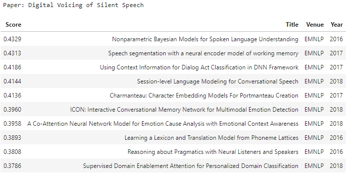
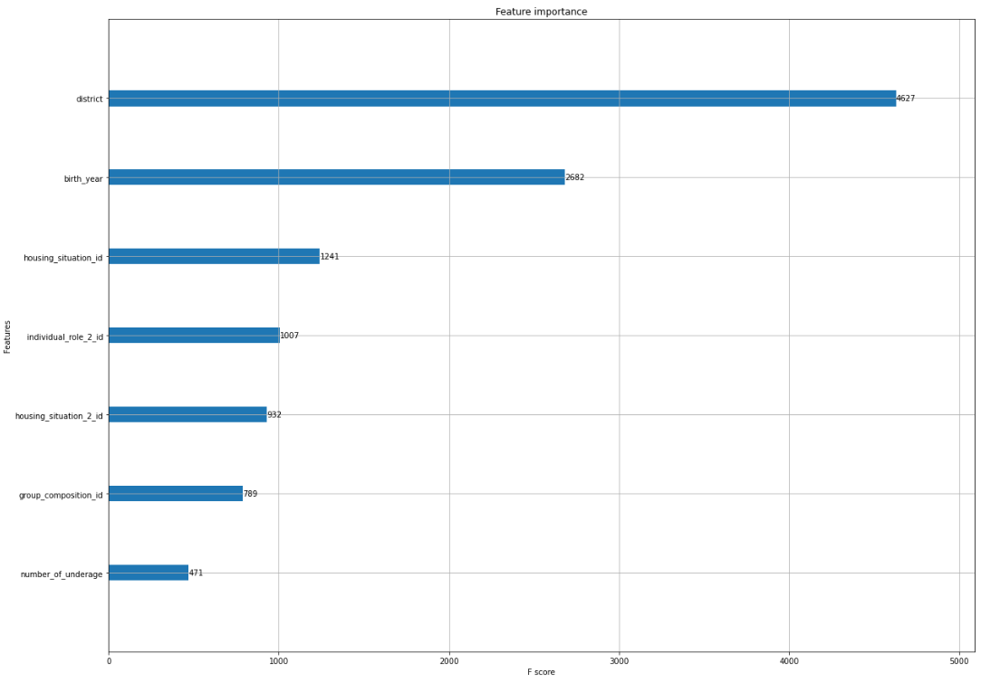

# Portfolio
---
## Ecommerce

This project involves classifying products into one of four categories: Electronics, Household, Books, and Clothing & Accessories. The dataset used for this task contains e-commerce text data specifically designed for classification purposes. 

 
<em>Technologies: Python, Bert, LinearSVC, MultinomialNB, LogisticRegression

 

---
## Semantic Search

This project shows how to combine sentence transformers(SBERT) and elasticsearch to find similar papers. SBERT give the embedding(dense vectors) for each papers. ElasticSearch store the dense vectors and use them for document scoring. As corpus, I use all EMNLP publications from 2016 - 2018. 

 
<em>Technologies: Python, SBert, Sentence transformer, Elasticsearch

 

---
## Auto Insurance

Based on information about cars, I predict the probability of crash. General description and data are available on <a href="https://www.kaggle.com/competitions/auto-insurance-fall-2017">Kaggle</a>. The dataset has a lot of features. This gives interesting possibilities for feature transformation and data visualization.

 
<em>Technologies: Python, EDA, Logistic regression, Random forest, Gradient boosting 

---
## Notification Pass Logement

Frustrated with repeatedly checking the Pass Logement platform for new apartment listings, I developed an automated solution. <strong>Notification Pass Logement</strong> streamlines the process by scraping the platform for updates and sending real-time notifications, ensuring no opportunity is missed.  

The system utilizes <strong>Scrapy</strong> for data extraction and <strong>Prefect</strong> for workflow orchestration, enabling seamless scheduling, monitoring, and deployment. Users can receive alerts whenever a new listing appears, eliminating the need for manual checks.

 
<em>Technologies: Python, Scrapy, Prefect</em>  

---
## Emergency Housing

The datasets are from the competition hosted in 2019 by <a href="https://www.datascience-olympics.com/">datascience olympics</a>. A tutorial notebook which included the custom metric competition_scorer and a baseline submission using a logistic regression model. I trained an XGBoost model.

 
<em>Technologies: Python, Sklearn, XGBoost 

 

---
