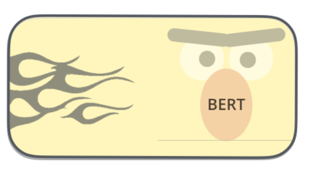

# Portfolio
---
## Semantic Search

This project shows how to combine sentence transformers(SBERT) and elasticsearch to find similar papers. SBERT give the embedding(dense vectors) for each papers. ElasticSearch store the dense vectors and use them for document scoring. As corpus, we use all EMNLP publications from 2016 - 2018. 

 
<em>Technologies: Python, Sentence transformer, Elasticsearch
<!--    -->

 

---
## Auto Insurance

Based on information about cars, we predict the probability of crash. General description and data are available on <a href="https://www.kaggle.com/competitions/auto-insurance-fall-2017">Kaggle</a>. The dataset has a lot of features. This gives interesting possibilities for feature transformation and data visualization.

 
<em>Technologies: Python, EDA, Logistic regression, Random forest, Gradient boosting 

---
## Facebook Scraper

In this project, I collect data from Facebook. We focus here on page audiences. In other words, we will get the likes and followers of each Facebook page.

 
<em>Technologies: Python, Selenium

 

---
## Instagram Scraper

Instagram provides an easy API to collect data without login. For each Instagram page, we will collect the followers, following, posts and biography.

 
<em>Technologies: Python, API Instagram

 

---
## Uber Nairobi Ambulance Perambulation Challenge

The aim of this challenge is to place six virtual ambulances around the city of Nairobi, moving them around throughout the day with the goal of minimising the distance travelled when responding to crashes during the test period. We submit a schedule of six ambulances every 3 hours. For each crash recorded, we find the distance between that crash and the nearest ambulance according to our schedule. 

 
<em>Technologies: Python, Fastai, Sklearn, Clustering

 

---
## Emergency Housing

The datasets are from the competition hosted in 2019 by <a href="https://www.datascience-olympics.com/">datascience olympics</a>. A tutorial notebook which included the custom metric competition_scorer and a baseline submission using a logistic regression model. I trained an XGBoost model.

 
<em>Technologies: Python, Sklearn, XGBoost 

 

---
