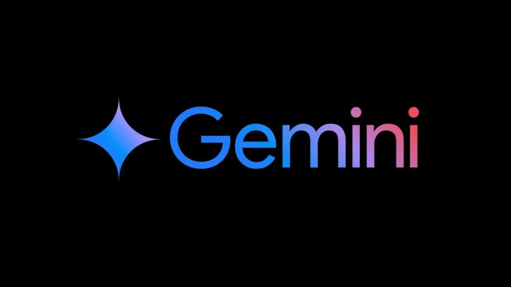
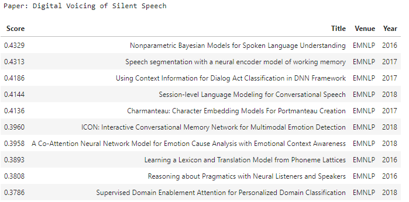
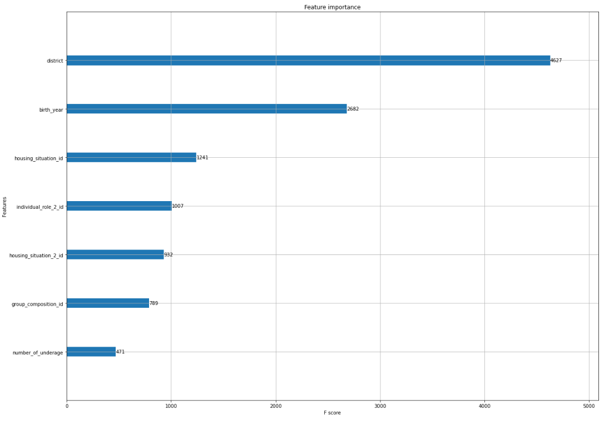

# Portfolio Data Science professionnel
---

Bienvenue sur mon portfolio Data Science. Je suis un ingénieur Data Science spécialiste NLP, ML, Deep Learning et production de pipelines.

- 10+ projets open source et compétitions Kaggle
- Spécialisation : OCR, NER, clusterisation, recommandation, analyse documentaire
- Stack : Python, Pandas, Scikit-Learn, XGBoost, TensorFlow/PyTorch, Docker, FastAPI

---

  

    

      

        
        

          <h5 class="card-title">Gemini Document Analysis</h5>
          
Pipeline E2E OCR + Gemini + NER pour extraction de données métiers à partir de PDF et images. Mesure de KPI de précision, couverture et temps de pipeline.

          
Tech : Python, Tesseract/DocTR, Transformers, FastAPI, Docker

          <a class="btn btn-outline-secondary btn-sm" href="https://github.com/balldatascientist/gemini-document-analysis">GitHub</a>
        

      

    

    

      

        
        

          <h5 class="card-title">Ecommerce Product Classification</h5>
          
Classification de produits e-commerce en 4 catégories (Electronics, Household, Books, Clothing) via BERT, LinearSVC et Logistic Regression.

          
Tech : Python, BERT, LinearSVC, MultinomialNB, LogisticRegression

          <a class="btn btn-outline-secondary btn-sm" href="https://github.com/ball-alhousseynou/Ecommerce">GitHub</a>
        

      

    

    

      

        
        

          <h5 class="card-title">Semantic Search</h5>
          
Recherche sémantique sur corpus EMNLP 2016-18 via embeddings SBERT et Elasticsearch Dense Vector avec évaluation MRR/Recall@k.

          
Tech : Python, SentenceTransformers, Elasticsearch

          <a class="btn btn-primary btn-sm me-2" href="projects/semantic_search.html">Notebook</a>
          <a class="btn btn-outline-secondary btn-sm" href="https://github.com/balldatascientist/Semantic-Search">GitHub</a>
        

      

    

    

      

        
        

          <h5 class="card-title">Auto Insurance</h5>
          
Modélisation du risque sinistre avec feature engineering, sélection de variables et comparaison de Logistic, Random Forest, XGBoost.

          
Tech : Python, Pandas, Scikit-Learn, XGBoost

          <a class="btn btn-primary btn-sm me-2" href="projects/autoinsurance.html">Notebook</a>
          <a class="btn btn-outline-secondary btn-sm" href="https://github.com/balldatascientist/Kaggle-Challenge-Auto-Insurance">GitHub</a>
        

      

    

    

      

        
        

          <h5 class="card-title">Notification Pass Logement</h5>
          
Scraping automatisé de la plateforme Pass Logement avec notifications temps réel dès qu'un nouveau logement est disponible, orchestré via Prefect.

          
Tech : Python, Scrapy, Prefect

          <a class="btn btn-outline-secondary btn-sm" href="https://github.com/ball-alhousseynou/notification-pass-logement">GitHub</a>
        

      

    

    

      

        
        

          <h5 class="card-title">Uber Nairobi Ambulance Perambulation</h5>
          
Optimisation de localisation d'ambulances en ville via clustering et simulation de distances pour réduire le temps de réponse.

          
Tech : Python, Fastai, Scikit-Learn

          <a class="btn btn-primary btn-sm me-2" href="projects/ambulance_perambulation.html">Notebook</a>
          <a class="btn btn-outline-secondary btn-sm" href="https://github.com/balldatascientist/Uber-Nairobi-Ambulance-Perambulation">GitHub</a>
        

      

    

    

      

        
        

          <h5 class="card-title">Emergency Housing</h5>
          
Compétition Data Science Olympics : pipeline d'analyse, scoring métier, modèle XGBoost avec metrics de validation cross-fold.

          
Tech : Python, Scikit-Learn, XGBoost

          <a class="btn btn-primary btn-sm me-2" href="projects/emergencyhousing.html">Notebook</a>
          <a class="btn btn-outline-secondary btn-sm" href="https://github.com/balldatascientist/emergency-housing">GitHub</a>
        

      

    

    

      

        

          Data Engineering
        

        

          <h5 class="card-title">Scraping & Data Engineering</h5>
          
Automatisation de collecte de données et pipelines ETL pour la construction de datasets fiables, robustes et réutilisables.

          
Tech : Python, Selenium, API REST

          
<a href="https://github.com/balldatascientist/Facebook-Scraper">Facebook Scraper</a>

          
<a href="https://github.com/balldatascientist/Instagram-Scraper">Instagram Scraper</a>

        

      

    

  

